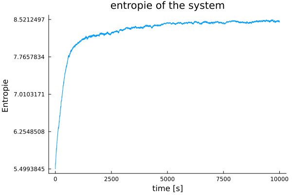
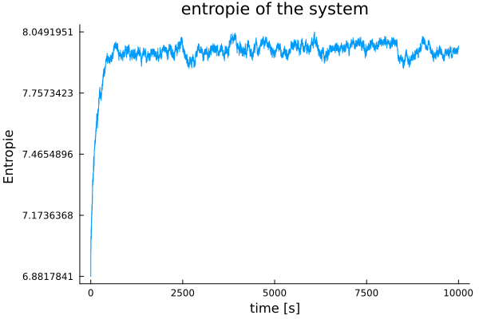
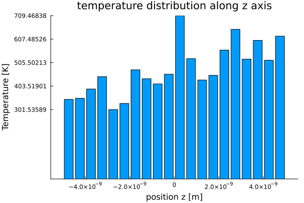

# multi agents simulation
# Exercice 2
## Exercice 2_1
### Masse
Pour calculer la masse, on utilise la masse molaire pour chaque gaz et on la divise par $N_A$ (nombre d’Avogadro) pour obtenir la masse d’une molécule en [kg]. Le 1000 c'est pour passer de [g] en [kg]. Si on a N2, faire la masse molaire présente dans le tableau périodique * 2.

$$
m = \frac{M}{N_A * 1000}
$$

- M = masse molaire [g/mol]
- $N_A$ = $6.022*10^{23}$ [1/mol]

- He
    - Masse molaire = 4.0026
    - Masse [kg] = 6.64663e-27
- Ne
    - Masse molaire = 20.180
    - Masse [kg] = 3.35105e-26
- N2
    - Masse molaire = 14.007 * 2 = 28.014
    - Masse [kg] = 4.65194e-26
- O2
    - Masse molaire = 15.999 * 2 = 31.998
    - Masse [kg] = 5.31352e-26

### Rayon

On prends le rayon de van der Waals : https://en.wikipedia.org/wiki/Van_der_Waals_radius

- He
    - https://fr.wikipedia.org/wiki/H%C3%A9lium
    - Rayon atomique [m] : 1.4e-10 
- Ne
    - https://fr.wikipedia.org/wiki/N%C3%A9on
    - Rayon atomique [m] : 1.54e-10 
- N2
    - https://en.wikipedia.org/wiki/Van_der_Waals_radius tableau a la fin de la page
    - ~ le rayon de N
    - Rayon atomique [m] : 1.55e-10
- O2
    - https://en.wikipedia.org/wiki/Van_der_Waals_radius tableau a la fin de la page
    - ~ le rayon de O
    - Rayon atomique [m] : 1.52e-10 
### Formule chimique

- He
- Ne
- N2
- O2

```julia
helium = Molecule([0.0,0.0,0.0],[0.0,0.0,0.0],6.64663e-27,1.4e-10 ,"He",[],[])
Neon = Molecule([0.0,0.0,0.0],[0.0,0.0,0.0],3.35105e-26,1.54e-10 ,"Ne",[],[])
diazote = Molecule([0.0,0.0,0.0],[0.0,0.0,0.0],4.65194e-26,1.55e-10,"N2",[],[])
dioxygene = Molecule([0.0,0.0,0.0],[0.0,0.0,0.0],5.31352e-26,1.52e-10 ,"O2",[],[])
```

```julia
positions = [[rand()*domain.lx-domain.lx/2,rand()*domain.ly-domain.ly/2,rand()*domain.lz-domain.lz/2], 
                [rand()*domain.lx-domain.lx/2,rand()*domain.ly-domain.ly/2,rand()*domain.lz-domain.lz/2], 
                [rand()*domain.lx-domain.lx/2,rand()*domain.ly-domain.ly/2,rand()*domain.lz-domain.lz/2], 
                [rand()*domain.lx-domain.lx/2,rand()*domain.ly-domain.ly/2,rand()*domain.lz-domain.lz/2]]

velocities = [[rand()*250.0-125.0,rand()*250.0-125.0,rand()*250.0-125.0], 
                [rand()*250.0-125.0,rand()*250.0-125.0,rand()*250.0-125.0], 
                [rand()*250.0-125.0,rand()*250.0-125.0,rand()*250.0-125.0], 
                [rand()*250.0-125.0,rand()*250.0-125.0,rand()*250.0-125.0]]

masses = [6.64663e-27, 3.35105e-26, 4.65194e-26, 5.31352e-26]
radius = [1.4e-10, 1.54e-10, 1.55e-10, 1.52e-10]
chemical_formulas = ["He", "Ne", "N2", "O2"]
```

## Exercice 2_2
La différentes est que on a He et Ne qui sont des atomes et N2 et O2 qui sont des molécules composée de 2 atomes. Comme la liason covalente dans les molécules N2 et O2 est très petite donc les atomes sont très proche, on peut considérer ces 2 molécules comme une sphère pour notre modèle. Donc la théorie s'applique bien avec cette lègre aproximation qui est de considérer que ça forme une sphère.

# Exercice 3

## Exercice 3_1

Il n'y a pas de force entre les molécules, donc il n'y a pas d'accélération. Les seuls intéractions entre les molécules sera lors des collisions

$
m \cdot \overrightarrow{a} = 0
$

$
\overrightarrow{a} = 0
$

$
\overrightarrow{v} = \overrightarrow{v_0}
$

$
\overrightarrow{r} = \overrightarrow{r_0} + \overrightarrow{v} (t)
$

## Exercice 3_2

$
\overrightarrow{r}(t + \Delta t) = \overrightarrow{r}(t) + \Delta t \cdot \overrightarrow{v} (t) 
$

# Exercice 4

## Exercice 4_1

On a le modèle des gaz parfais donc les molécules molécules sont assimilées à des sphères. Elles n’interagissent pas à distance.
Lorsqu’elles se touchent, elles subissent un choc élastique.

## Exercice 4_2

### Scenarios
#### 1

Les 2 molécules se percutent avec la même masse, la vitesse opposée, et la direction opposée.
Normalement, elle devrait se repousser

```julia
positions = [[-0.1,0.0,0.0],[0.1,0.0,0.0]]
velocities = [[5.0,0.0,0.0],[-5.0,0.0,0.0]]
masses = [1.0,1.0]
radius = [0.01,0.01]
chemical_formulas = ["TEST","TEST"]
```

#### 2

Il y a une molécule qui est immobile et une qui lui fonce dessus. Elles ont la même masses.
Normalement, la molécule immobile devrait prendre toute la vitesse de cela qui la percute et cela qui était en mouvement se stoppe. 

```julia
positions = [[0.0,0.0,0.0],[0.1,0.0,0.0]]
velocities = [[0.0,0.0,0.0],[-5.0,0.0,0.0]]
masses = [1.0,2.0]
radius = [0.01,0.01]
chemical_formulas = ["TEST","TEST"]
```

#### 3

Les 2 molécules se percutent avec la même masse, la vitesse opposée, et la direction opposée avec un légé décalage en hauteur (rayon//2).
Normalement, elle devrait se repousser et partir avec une angle de 45°

```julia
positions = [[-0.1,0.0,0.005],[0.1,0.0,0.0]]
velocities = [[5.0,0.0,0.0],[-5.0,0.0,0.0]]
masses = [1.0,1.0]
radius = [0.01,0.01]
chemical_formulas = ["TEST","TEST"]
```

#### 4

Les 2 molécules se percutent avec la une masse différente, la vitesse dans le même sens mais pas la même, celle devant a une vitesse supérieur, et la direction opposée avec un légé décalage en hauteur (rayon//2).
Normalement, elle devrait se repousser et partir avec une angle de 45°

```julia
positions = [[0.0,0.0,0.0],[0.1,0.0,0.0]]
velocities = [[-2.5,0.0,0.0],[-10.0,0.0,0.0]]
masses = [0.000001,1.0]
radius = [0.01,0.01]
chemical_formulas = ["TEST","TEST"]
```

# Exercice 5
## Exercice 5_1

```julia
mutable struct Domain
    lx::Float64
    ly::Float64
    lx::Float64
end
```

## Exercice 5_2

```julia
function domainVolume(cuboid::Domain)
    return cuboid.lx * cuboid.ly * cuboid.lz
end
```

## Exercice 5_3

Pour vérifier le domaine et le volume, on peut déclarer un domaine de 2m x 2m x 2m et vérifier que le volume soit bien de 8m^3. Pareil pour 1m x 1m x 1m que le volume soit bien 1m^3

```julia
domain_test::Domain = Domain(2.0,2.0,2.0)
@assert domainVolume(domain_test) == 8.0
println(domainVolume(domain_test))

domain_test::Domain = Domain(1.0,1.0,1.0)
@assert domainVolume(domain_test) == 1.0
println(domainVolume(domain_test))
```

# Exercice 6
## 6_1

Prendre en compte le rayon de la molécule dans le calcule de la distance

## 6_2

### 1

Test de faire rebondir la molécule sur le mur x

```julia
positions = [[0.0,0.0,0.0]]
velocities = [[15.0,0.0,0.0]]
masses = [1.0]
radius = [0.01]
chemical_formulas = ["TEST"]
```

### 2

Test de faire rebondir la molécule sur le mur y

```julia
positions = [[0.0,0.0,0.0]]
velocities = [[0.0,15.0,0.0]]
masses = [1.0]
radius = [0.01]
chemical_formulas = ["TEST"]
```

### 3

Test de faire rebondir la molécule sur le mur z

```julia
positions = [[0.0,0.0,0.0]]
velocities = [[0.0,0.0,15.0]]
masses = [1.0]
radius = [0.01]
chemical_formulas = ["TEST"]
```

### 4

Test de faire rebondir la molécule dans le coin entre 2 murs

```julia
positions = [[0.0,0.0,0.0]]
velocities = [[15.0,0.0,15.0]]
masses = [1.0]
radius = [0.01]
chemical_formulas = ["TEST"]
```

### 5

Test de faire rebondir la molécule dans le coin entre 3 murs

```julia
positions = [[0.0,0.0,0.0]]
velocities = [[15.0,15.0,15.0]]
masses = [1.0]
radius = [0.01]
chemical_formulas = ["TEST"]
```

### 6

Test de faire rebondir sur 2 mur

```julia
positions = [[0.0,0.0,0.0]]
velocities = [[0.0,7.5,15.0]]
masses = [1.0]
radius = [0.01]
chemical_formulas = ["TEST"]
```

### 7

Molécule plus lourde qui bloque la molécule plus légère contre le mur

```julia
positions = [[0.0,0.0,0.0],[0.3,0.0,0.0]]
velocities = [[-5.0,0.0,0.0],[-10.0,0.0,0.0]]
masses = [0.5,1.0]
radius = [0.01,0.01]
chemical_formulas = ["TEST","TEST"]
```

### 8

Test d'une molécule qui arrive contre le mur très vite

```julia
positions = [[0.0,0.0,0.0]]
velocities = [[100.0,0.0,0.0]]
masses = [1.0]
radius = [0.01]
chemical_formulas = ["TEST"]
```

# Exerice 7
## 7_1

nb steps = $(2*10^-11) / (2*10^-14)$ ou $(2e-11) / (1e-14)$

```julia
number_of_steps::Int64 = 2000
FPS = 30

dt::Float64 = 1.0e-14

positions::Vector{Vector{Float64}} = []
velocities::Vector{Vector{Float64}} = []
masses::Vector{Float64} = []
radius::Vector{Float64} = []
chemical_formulas::Vector{String} = []

domain::Domain = Domain(10e-9,10e-9,10e-9)
velocityValue::Float64 = 1500 # [m/s]

# Random generation

for i in 1:400
    push!(positions, [rand()*domain.lx-domain.lx/2,rand()*domain.ly-domain.ly/2,rand()*domain.lz-domain.lz/2])

    velocity::Vector{Float64} = [rand()*10-5,rand()*10-5,rand()*10-5]
    velocity = velocity ./ sqrt(sum(velocity .^2))
    velocity = velocity .* velocityValue

    @assert round(Int, sqrt(sum(velocity .^2))) == velocityValue

    push!(velocities, velocity)
    push!(masses, 6.646e-27)
    push!(radius, 1.1e-10)
    push!(chemical_formulas, "He")
end
```

## 7_2

La vitesse moyenne diminue au cours du temps puis se stabilise vers a peut prêt 1300

## 7_3

La distribution est en forme de cloche et la moyenne à diminuée

## 7_4

m = [kg]
<v^2> = [m^2 / s^2]

m*v^2 au niveau des unités est égale à l'unité de Ecin donc on a des [J] au numérateur

kb = [J/K]

alpha = [J/(J/K)] = [K]

donc alpha est en Kelvin, alpha représente la température


```julia
kb = 1.380649e-23 # [J/K]
masses = sum([m.mass for m in molecules]) # [kg]
mean_velocity = calcMeanVelocity(molecules, t) ^ 2 # [m^2/s^2] 

alpha = (masses * mean_velocity) /  (3*kb)
```

## 7_5

m = [kg]
<v^2> = [m^2 / s^2]

V = [m^3]

beta = [J/m^3] = [N/m^2] = [Pa] 

beta représente la pression et est donc en Pascal

```julia
number_atomes = length(molecules) 
masses = sum([m.mass for m in molecules]) # [kg]
mean_velocity = calcMeanVelocity(molecules, t) ^ 2 # [m^2/s^2] 
domain_volume = domainVolume(cuboid) # [m^3]

beta = (number_atomes * masses * mean_velocity) /  (3 * domain_volume)
```

# Exercice 8
## 8_3

26.85° -> 300 K
$$

v_{grav helium} =  \frac{6.646 \cdot 10^{-27} \cdot 9.81 \cdot 6.5 \cdot 10^{-5}}{1.380649 \cdot 10^{-23} \cdot 300} = 1.02315 \cdot 10^{-9} [m/s]

$$

Donc pour faire 1 mètre on prends :

$$
1 / 1.02315 \cdot 10^{-9} = 9.77374 \cdot 10^8 [s] = 30.9718 [years]
$$

le but de la vitesse c'est de dire sur 1m, en cb de temps on commence a initier un mouvement uniquement du a la gravité.

## 8_4

```julia
number_of_steps::Int64 = 5000 # ou 10000 si on veut un truc stable
FPS = 60

g = [0,0,-9.81 * 10^13]

dt::Float64 = 1.0e-14

positions::Vector{Vector{Float64}} = []
velocities::Vector{Vector{Float64}} = []
masses::Vector{Float64} = []
radius::Vector{Float64} = []
chemical_formulas::Vector{String} = []

domain::Domain = Domain(4e-8,4e-8,4e-8)
velocityValue::Float64 = 1367 # [m/s]

number_atomes = 500

# Random generation

for i in 1:number_atomes
    push!(positions, [rand()*domain.lx-domain.lx/2,rand()*domain.ly-domain.ly/2,rand()*domain.lz-domain.lz/2])

    velocity::Vector{Float64} = [rand()*10-5,rand()*10-5,rand()*10-5]
    velocity = velocity ./ sqrt(sum(velocity .^2))
    velocity = velocity .* velocityValue

    @assert round(Int, sqrt(sum(velocity .^2))) == velocityValue

    push!(velocities, velocity)
    push!(masses, 6.646e-27)
    push!(radius, 1.1e-10)
    push!(chemical_formulas, "He")
end
```

## 8_5

La turbopause c'est une frontière entre deux zone de l'atmosphère.

En dessous (Homosphère), les gaz sont bien mélangé grâce au mouvement turbulents (Vents,...). La composition de l'air reste presque constante.

En dessus (Heterosphère), les gaz ne sont plus mélangé de la même manière.Ils se séparent selon leur masse (Les plus légé montent plus haut)

On a cette limite car les mouvements turbulents devient trop faible pour bien mélanger les gaz.

La limite se situe a 80-120 km d'altitude

## 8_6

Plus on est haut moin la pression est forte.

# Exercice 9
## Configuration before
```julia
    number_of_steps::Int64 = 10000
    FPS = 60

    g = [0,0,-9.81 * 10^13]

    dt::Float64 = 1.0e-14

    positions::Vector{Vector{Float64}} = []
    velocities::Vector{Vector{Float64}} = []
    masses::Vector{Float64} = []
    radius::Vector{Float64} = []
    chemical_formulas::Vector{String} = []

    domain::Domain = Domain(4e-8,4e-8,4e-8)
    velocityValue::Float64 = 1367 # [m/s]
    
    number_atomes = 500

    # Random generation

    for i in 1:number_atomes
        push!(positions, [rand()*domain.lx-domain.lx/2,rand()*domain.ly-domain.ly/2,rand()*domain.lz-domain.lz/2])

        velocity::Vector{Float64} = [rand()*10-5,rand()*10-5,rand()*10-5]
        velocity = velocity ./ sqrt(sum(velocity .^2))
        velocity = velocity .* velocityValue

        @assert round(Int, sqrt(sum(velocity .^2))) == velocityValue

        push!(velocities, velocity)
        push!(masses, 6.646e-27)
        push!(radius, 1.1e-10)
        push!(chemical_formulas, "He")
    end
```
## 9_1
```julia
    number_of_steps::Int64 = 5000
    FPS = 240

    g = [0,0,-9.81 * 10^13]

    dt::Float64 = 1.0e-14

    positions::Vector{Vector{Float64}} = []
    velocities::Vector{Vector{Float64}} = []
    masses::Vector{Float64} = []
    radius::Vector{Float64} = []
    chemical_formulas::Vector{String} = []

    domain::Domain = Domain(2e-8, 2e-8, 2e-8)

    # Random generation

    velocityValue::Float64 = 789.45 # [m/s]
    number_atomes::Int64 = 400

    for i in 1:number_atomes
        push!(positions, [rand()*domain.lx-domain.lx/2,rand()*domain.ly-domain.ly/2,rand()*domain.lz-domain.lz/2])

        velocity::Vector{Float64} = [rand()*10-5,rand()*10-5,rand()*10-5]
        velocity = velocity ./ sqrt(sum(velocity .^2))
        velocity = velocity .* velocityValue

        @assert isapprox(sqrt(sum(velocity .^ 2)), velocityValue; atol=1e-6)

        push!(velocities, velocity)
        push!(masses, 6.646e-27)
        push!(radius, 1.1e-10)
        push!(chemical_formulas, "He")
    end

    velocityValue = 249.88 # [m/s]
    number_atomes = 200

    for i in 1:number_atomes
        push!(positions, [rand()*domain.lx-domain.lx/2,rand()*domain.ly-domain.ly/2,rand()*domain.lz-domain.lz/2])

        velocity::Vector{Float64} = [rand()*10-5,rand()*10-5,rand()*10-5]
        velocity = velocity ./ sqrt(sum(velocity .^2))
        velocity = velocity .* velocityValue

        @assert isapprox(sqrt(sum(velocity .^ 2)), velocityValue; atol=1e-6)

        push!(velocities, velocity)
        push!(masses, 6.634e-26)
        push!(radius, 1.88e-10)
        push!(chemical_formulas, "Ar")
    end

```
## 9_3

- <v^2>

- <m*v^2>

Enfaite avant pour calculer la température et la préssion, on pouvait sortir la masse vu que c'était la meme pour toute les molécule mais la mtn on peut plus, car on a des molécules différentes ducoup faut mettre dans la moyenne la masse * la vitesse

# Exercice 10
## 10_1
Pour évaluer la stabilité de la simulation, on peut regarder Ecin, Temperature ou la pression, la simulation est terminée lorsque ces valeurs sont stables.

On peut regarder à l'aide d'une fenètre glissance lorsque la variance de ces valeurs devient inférieur à un certain seuil.
Je vais partie sur Ecin moyenne.

# Exercice 11
## 11_1

Distribution de Boltzmann

Dépend de la température, l'énergie mécanique.

## 11_2

La position des molécules.
La pression 

# Exercice 12
## 12_2
```julia
    number_of_steps::Int64 = 5000
    FPS = 240

    g = [0.0,0.0,0.0]

    dt::Float64 = 1.0e-14

    positions::Vector{Vector{Float64}} = []
    velocities::Vector{Vector{Float64}} = []
    masses::Vector{Float64} = []
    radius::Vector{Float64} = []
    chemical_formulas::Vector{String} = []

    domain::Domain = Domain(1e-8, 1e-8, 1e-8)

    # Random generation

    velocityValue::Float64 = 1400 # [m/s]
    number_atomes::Int64 = 400

    for i in 1:number_atomes
        push!(positions, [
            rand()*domain.lx/2-domain.lx/2,
            rand()*domain.ly/2-domain.ly/2,
            rand()*domain.lz/2-domain.lz/2
            ])

        velocity::Vector{Float64} = [rand()*10-5,rand()*10-5,rand()*10-5]
        velocity = velocity ./ sqrt(sum(velocity .^2))
        velocity = velocity .* velocityValue

        @assert isapprox(sqrt(sum(velocity .^ 2)), velocityValue; atol=1e-6)

        push!(velocities, velocity)
        push!(masses, 6.646e-27)
        push!(radius, 1.1e-10)
        push!(chemical_formulas, "He")
    end
```

## 12_3

```julia
    number_of_steps::Int64 = 10000
    FPS = 240

    g = [0.0,0.0,0.0]

    dt::Float64 = 1.0e-14

    positions::Vector{Vector{Float64}} = []
    velocities::Vector{Vector{Float64}} = []
    masses::Vector{Float64} = []
    radius::Vector{Float64} = []
    chemical_formulas::Vector{String} = []

    domain::Domain = Domain(2e-8, 1e-8, 1e-8)

    # Random generation

    velocityValue::Float64 = 1400 # [m/s]
    number_atomes::Int64 = 400

    for i in 1:number_atomes
        push!(positions, [
            rand()*domain.lx/2-domain.lx/2,
            rand()*domain.ly/2-domain.ly/2,
            rand()*domain.lz/2-domain.lz/2
            ])

        velocity::Vector{Float64} = [rand()*10-5,rand()*10-5,rand()*10-5]
        velocity = velocity ./ sqrt(sum(velocity .^2))
        velocity = velocity .* velocityValue

        @assert isapprox(sqrt(sum(velocity .^ 2)), velocityValue; atol=1e-6)

        push!(velocities, velocity)
        push!(masses, 6.646e-27)
        push!(radius, 1.1e-10)
        push!(chemical_formulas, "He")
    end
```



# Exercice 13
## 13_1
Car on chauffe uniquement le gaz en haut et en bas et pas a gauche, doite devant et derrière. Donc on a un gradient de température dans la direction z et pas dans les autres directions.

## 13_2
```julia
    number_of_steps::Int64 = 10000
    FPS = 240

    g = [0.0,0.0,0.0]

    dt::Float64 = 1.0e-14

    positions::Vector{Vector{Float64}} = []
    velocities::Vector{Vector{Float64}} = []
    masses::Vector{Float64} = []
    radius::Vector{Float64} = []
    chemical_formulas::Vector{String} = []

    domain::Domain = Domain((-2e-9, 2e-9), (-2e-9, 2e-9), (-5e-9, 5e-9))
    new_domain::Domain = Domain((-5e-9, 15e-9), (-5e-9, 5e-9), (-5e-9, 5e-9))
    temperature_top::Float64 = 700 # [K]
    temperature_bottom::Float64 = 300 # [K]

    # Random generation

    velocityValue::Float64 = 1400 # [m/s]
    number_atomes::Int64 = 500

    spawn_domain::Domain = Domain((-2e-9, 2e-9), (-2e-9, 2e-9), (-5e-9, 5e-9))
    
    for i in 1:number_atomes
        push!(positions, [
                rand() * (spawn_domain.lx[2] - spawn_domain.lx[1]) + spawn_domain.lx[1],
                rand() * (spawn_domain.ly[2] - spawn_domain.ly[1]) + spawn_domain.ly[1],
                rand() * (spawn_domain.lz[2] - spawn_domain.lz[1]) + spawn_domain.lz[1]
            ])

        velocity::Vector{Float64} = [rand()*10-5,rand()*10-5,rand()*10-5]
        velocity = velocity ./ sqrt(sum(velocity .^2))
        velocity = velocity .* velocityValue

        @assert isapprox(sqrt(sum(velocity .^ 2)), velocityValue; atol=1e-6)

        push!(velocities, velocity)
        push!(masses, 6.646e-27)
        push!(radius, 1.1e-10)
        push!(chemical_formulas, "He")
    end
```

## 13_4



## 13_5

